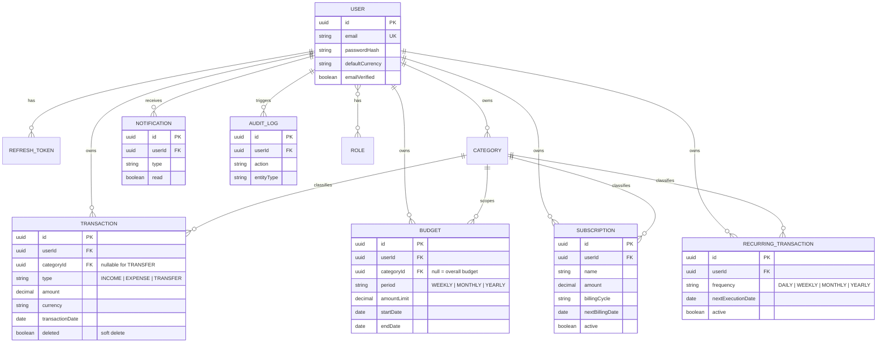

# FinTrack

A production-oriented full-stack personal finance and subscription management system — built to demonstrate real engineering practices, not just CRUD, on both ends of the stack.

FinTrack lets a user track income/expense transactions, set category or overall budgets with automatic warning/exceeded alerts, manage recurring payments and subscriptions, and get algorithmic insights into their spending — all behind a JWT-secured, rate-limited, audited REST API, with a matching React/TypeScript web client in **[`frontend/`](frontend/README.md)**.

## Table of Contents

- [Features](#features)
- [Tech Stack](#tech-stack)
- [Frontend](#frontend)
- [Architecture](#architecture)
- [Data Model](#data-model)
- [API](#api)
- [Getting Started](#getting-started)
- [Environment Variables](#environment-variables)
- [Testing](#testing)
- [Future Improvements](#future-improvements)

## Features

- **Auth** — register/login with JWT access tokens + rotating opaque refresh tokens, email verification, forgot/reset password, role-based authorization (`USER`/`ADMIN`, extensible without a schema change)
- **Transactions** — income/expense/transfer CRUD, ownership-validated, soft-deleted (financial records are never physically removed), filterable by type/category/date range with pagination
- **Categories** — system defaults + user-defined, income/expense typed
- **Budgets** — per-category or overall, weekly/monthly/yearly, live usage % with OK/WARNING/EXCEEDED status
- **Subscriptions** — tracked recurring bills with a distinct cancel (soft, reversible) vs delete
- **Recurring transactions** — templates that a scheduler turns into real transactions automatically, catching up on missed periods
- **Notifications** — budget alerts, subscription/payment reminders, deduplicated so the same alert never repeats within a period
- **Analytics** — monthly dashboard, category distribution, spending trends, period-over-period comparison, and five algorithmic "smart insights"
- **Audit log** — immutable before/after trail for transaction, budget, and subscription-cancel actions
- **Rate limiting** — Redis-backed, fails open (never lets a rate-limiter outage block real logins)

## Tech Stack

| Layer | Choice |
|---|---|
| Language | Java 21 |
| Framework | Spring Boot 3.5 |
| Security | Spring Security, JWT (JJWT), BCrypt |
| Persistence | Spring Data JPA / Hibernate, PostgreSQL, Flyway |
| Caching / rate limiting | Redis |
| Docs | springdoc-openapi (Swagger UI) |
| Build | Maven |
| Testing | JUnit 5, Mockito, AssertJ, Testcontainers |
| Containerization | Docker, Docker Compose |
| CI | GitHub Actions |

## Frontend

A full React 19 + TypeScript web client lives in **[`frontend/`](frontend/README.md)** — Vite, React Router, TanStack Query, Zustand, React Hook Form + Zod, Tailwind CSS v4 with shadcn/ui, and Recharts. It covers every module above: auth (with silent refresh-token session restore), transactions with filtering, budgets with live usage bars, subscriptions and recurring payments, an analytics dashboard with charts and generated insights, notifications, exportable reports, and account settings. See the frontend README for its own architecture notes and setup instructions.

## Architecture

Package-by-feature (`auth`, `user`, `transaction`, `category`, `budget`, `subscription`, `recurring`, `notification`, `analytics`, `audit`, `security`, `common`, `config`) rather than package-by-layer — each module owns its full vertical slice (controller → service → repository → dto → entity).

Modules stay decoupled through **Spring Events**: creating a transaction publishes `TransactionCreatedEvent`; a `BudgetEventListener` (unaware to `TransactionService`) reacts to it after the transaction commits, recomputes the relevant budget, and raises a notification if a threshold is crossed. The same pattern drives registration/password-reset emails.

Full architecture rationale, decision log, and the original design document live in **[docs/ARCHITECTURE.md](docs/ARCHITECTURE.md)**.

## Data Model



## API

Base path: `/api/v1`. Every response is wrapped in a consistent envelope (`{ success, data, message, timestamp }` for success, `{ timestamp, status, error, message, path, fieldErrors }` for errors).

With the app running, browse the full interactive spec at **`/swagger-ui.html`** (OpenAPI JSON at `/v3/api-docs`).

| Module | Base path |
|---|---|
| Auth | `/api/v1/auth` |
| User | `/api/v1/users/me` |
| Categories | `/api/v1/categories` |
| Transactions | `/api/v1/transactions` |
| Budgets | `/api/v1/budgets` |
| Subscriptions | `/api/v1/subscriptions` |
| Recurring transactions | `/api/v1/recurring-transactions` |
| Notifications | `/api/v1/notifications` |
| Analytics | `/api/v1/analytics` |

## Getting Started

### Run everything with Docker Compose

```bash
docker compose up --build
```

This starts PostgreSQL, Redis, and the app itself. The API is then available at `http://localhost:8080`, Swagger UI at `http://localhost:8080/swagger-ui.html`.

> If port `5432` is already taken by a local PostgreSQL install, the Postgres container in this compose file maps to host port `5433` instead (`docker-compose.yml`) — that only affects connecting from the host, not from the `app` container, which talks to `postgres:5432` over the compose network.

### Run locally (dependencies in Docker, app from your IDE/Maven)

```bash
docker compose up -d postgres redis
mvn spring-boot:run
```

Requires Java 21 and Maven. The app defaults to `localhost:5432`/`localhost:6379` when run outside Docker — override with the environment variables below if your Postgres/Redis live elsewhere.

### Run the frontend

With the backend running (either method above), in a separate terminal:

```bash
cd frontend
npm install
npm run dev
```

Opens at `http://localhost:5173`. See **[frontend/README.md](frontend/README.md)** for details — it talks to the backend at `http://localhost:8080/api/v1` by default, which requires `CORS_ALLOWED_ORIGINS` on the backend to include `http://localhost:5173` (already the default).

## Environment Variables

All have sane local-dev defaults (see `application.yml`); override for anything beyond local development.

| Variable | Purpose | Default |
|---|---|---|
| `DB_URL`, `DB_USERNAME`, `DB_PASSWORD` | PostgreSQL connection | `jdbc:postgresql://localhost:5432/fintrack`, `fintrack`, `fintrack` |
| `REDIS_HOST`, `REDIS_PORT` | Redis connection | `localhost`, `6379` |
| `JWT_SECRET` | HMAC signing key for access tokens — **must** be overridden in any real deployment | dev-only placeholder |
| `JWT_ACCESS_EXPIRATION_MS`, `JWT_REFRESH_EXPIRATION_MS` | Token lifetimes | 15 min, 7 days |
| `MAIL_HOST`, `MAIL_USERNAME`, `MAIL_PASSWORD` | SMTP for verification/reset emails | unset — sends are logged, not delivered |
| `FRONTEND_URL` | Base URL used to build email links | `http://localhost:3000` |
| `AUTH_RATE_LIMIT_MAX`, `AUTH_RATE_LIMIT_WINDOW_SECONDS` | Rate limit on `/auth/login`, `/auth/register`, `/auth/forgot-password` | 5 requests / 60s |

## Testing

```bash
mvn test
```

32 tests: unit tests (Mockito) for budget threshold math, analytics percentage calculations, JWT round-tripping, and notification deduplication; integration tests (Testcontainers, a real PostgreSQL container per run — no H2) for the full register→login→refresh-rotation auth lifecycle, cross-user IDOR protection on transactions, soft-delete visibility, and the repository-level aggregate queries analytics/budgets rely on. Requires Docker to be running.

## Future Improvements

- Multi-currency exchange-rate conversion (the domain models a `Currency` per record today; converting and aggregating across currencies needs an external rate API with caching/fallback — deliberately scoped out for now)
- Persisted `FinancialInsight` history (insights are currently computed live on each request rather than stored)
- Refresh-token reuse detection (rotation already invalidates the previous token; detecting reuse of an already-rotated token as a compromise signal, and revoking the whole token family, is a natural hardening step)
- MapStruct for entity↔DTO mapping if the manual `Response.from(entity)` methods start feeling repetitive at scale
