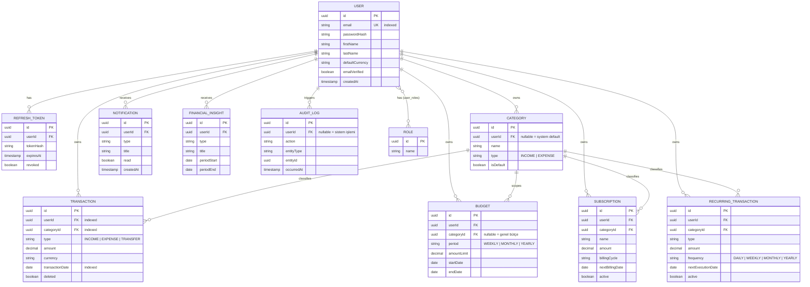

# FinTrack — Mimari & Planlama Dökümanı

Bu döküman kod yazımına başlamadan önce hazırlanmıştır. Amaç: entity/ilişki modelini,
API yüzeyini, paket yapısını ve faz planını netleştirip onaylamak.

---

## 1. Genel Bakış

**FinTrack**, kullanıcıların gelir/gider, bütçe, abonelik ve tekrarlayan ödemelerini
tek bir sistemden yönetmesini sağlayan bir kişisel finans backend'idir.

Tasarım hedefleri:
- Basit bir CRUD uygulaması değil; **event-driven**, **cacheli**, **test edilebilir**,
  **production-oriented** bir sistem.
- Modüller arası **loose coupling** (Spring Events ile).
- Her kaynağa erişimde **ownership validation** (IDOR koruması).
- **Package-by-feature** mimari — büyüdükçe okunabilirliğini koruyan bir yapı.

---

## 2. Mimari Kararlar

### 2.1 Katmanlı yapı (feature içinde)

Her feature paketi kendi içinde şu katmanlara sahiptir:

```
controller  →  service  →  repository  →  (database)
   ↓              ↓
  dto          entity
   ↓
 mapper
```

Kurallar:
- **Controller thin olmalı** — sadece request/response dönüşümü ve validation tetikleme.
  İş kuralı controller'a sızmaz.
- **Business logic service layer'da** — transaction sınırları (`@Transactional`)
  burada başlar.
- **Constructor injection zorunlu** — field injection kullanılmaz. Neden: bağımlılıklar
  açık olur, immutable yapılabilir, test'te mock verilmesi kolaylaşır (Mockito ile
  constructor'a mock geçmek, `@Autowired` field'ı reflection'la değiştirmekten çok
  daha temizdir).
- **Entity dışarı sızmaz** — response her zaman DTO. Entity'yi doğrudan dönmek,
  lazy-loading exception'larına (`LazyInitializationException`) ve istemeden internal
  alanların (örn. `passwordHash`) expose edilmesine yol açar.

### 2.2 Neden package-by-feature (package-by-layer değil)

`com.fintrack.controller`, `com.fintrack.service`, `com.fintrack.repository` gibi
katman bazlı paketleme yerine `com.fintrack.transaction`, `com.fintrack.budget` gibi
özellik bazlı paketleme seçildi.

Gerekçe:
- Bir özelliği değiştirirken (örn. Budget) tek klasörde çalışılır; katmanlar arası
  IDE sekmesi zıplama azalır.
- **Yüksek cohesion, düşük coupling** — bir feature'ın tüm parçaları birlikte durur.
- İleride mikroservise bölünmek istenirse, sınırlar zaten feature paketleri ile
  çizilmiş olur.
- Büyük katman bazlı projelerde (`service/` altında 40 dosya) isim çakışmaları ve
  "hangi service hangi controller'a ait" karmaşası yaşanır; feature bazlıda yaşanmaz.

### 2.3 Event-driven modüller arası iletişim

`Transaction` oluşturulduğunda `Budget` modülünün haberdar olması gerekir (harcama
limiti kontrolü için), ama `TransactionService`'in doğrudan `BudgetService`'e bağımlı
olması istenmez (sıkı bağlılık, dairesel bağımlılık riski, test etmesi zor).

Çözüm: `TransactionCreatedEvent` yayınlanır, `BudgetEventListener` bunu dinler.

```
TransactionService.create()
   → publish(TransactionCreatedEvent)
        → BudgetEventListener.onTransactionCreated()
             → limit kontrolü → %80/%100 ise NotificationEvent yayınla
        → RecurringTransactionEventListener (varsa nextExecutionDate güncelle)
```

Bu, Spring'in `ApplicationEventPublisher` / `@EventListener` (veya async için
`@TransactionalEventListener(phase = AFTER_COMMIT)`) mekanizmasıyla yapılır.
`AFTER_COMMIT` kullanılması önemlidir: budget kontrolü, transaction veritabanına
gerçekten yazıldıktan sonra çalışmalı, aksi halde rollback olan bir transaction için
de bildirim üretilebilir.

**Portfolyo değeri:** Event-driven mimari + SOLID'in "D" prensibi (Dependency
Inversion) somut bir örnekle gösterilir; bu, junior/mid seviyeyi ayıran konulardan
biridir.

### 2.4 Güvenlik mimarisi

- **JWT Access Token** (kısa ömürlü, örn. 15 dk) + **Refresh Token** (uzun ömürlü,
  örn. 7 gün, DB'de hash'lenmiş halde saklanır, rotate edilir).
- Refresh token DB'de tutulur ki **logout / revoke** mümkün olsun (salt stateless JWT
  ile bu yapılamaz — bu, "neden pure stateless JWT yetmez" sorusunun cevabıdır).
- `SecurityFilterChain` ile endpoint bazlı yetkilendirme (`/api/v1/auth/**` public,
  geri kalanı authenticated).
- Her feature service'inde **ownership check**: `if (!resource.getUserId().equals(
  currentUserId)) throw new ForbiddenException()`. Bu kontrol tekrar eden bir
  pattern olduğu için `common` paketinde reusable bir yardımcı olarak çıkarılacak.
- **Rate limiting**: Redis `INCR` + `EXPIRE` ile sliding-window benzeri sayaç,
  özellikle `/auth/login` ve `/auth/register` için. Limit aşımında `429`.

---

## 3. Veri Modeli

### 3.1 Entity'ler ve amaçları

| Entity | Amaç |
|---|---|
| `User` | Hesap sahibi, kimlik ve profil bilgisi |
| `Role` | USER / ADMIN (genişletilebilir, many-to-many) |
| `RefreshToken` | Aktif oturum/refresh token kayıtları (revoke edilebilir) |
| `Category` | Gelir/gider kategorisi; `userId = null` ise sistem varsayılanı |
| `Transaction` | Tekil gelir/gider/transfer kaydı (soft delete) |
| `Budget` | Kategori bazlı veya genel harcama limiti + periyot |
| `Subscription` | Tekrarlayan abonelik ödemesi (Netflix, Spotify vb.) |
| `RecurringTransaction` | Otomatik oluşturulacak gelir/gider şablonu |
| `Notification` | Kullanıcıya gösterilecek sistem/uyarı mesajı |
| `FinancialInsight` | Algoritmik olarak üretilmiş finansal gözlem |
| `AuditLog` | Kritik işlemlerin değişmez kaydı |

### 3.2 ER Diyagramı



**Index kararları:** `user.email` (unique + login sorgusu), `transaction.user_id`,
`transaction.category_id`, `transaction.transaction_date` (filtreleme/analiz sorguları
bu üçü üzerinden yapılacağı için composite index adayı:
`(user_id, transaction_date, deleted)`).

---

## 4. API Uç Nokta Planı

Base path: `/api/v1`. Tüm response'lar tutarlı bir zarf (`ApiResponse<T>` veya
`Page<T>`) içinde döner; hata formatı `GlobalExceptionHandler` üzerinden tek tipleştirilir.

### Auth
| Method | Path | Açıklama |
|---|---|---|
| POST | `/auth/register` | Yeni kullanıcı kaydı |
| POST | `/auth/login` | Giriş, access+refresh token döner |
| POST | `/auth/refresh` | Access token yenileme |
| POST | `/auth/logout` | Refresh token revoke |
| POST | `/auth/verify-email` | E-posta doğrulama |
| POST | `/auth/forgot-password` | Şifre sıfırlama e-postası tetikle |
| POST | `/auth/reset-password` | Token ile yeni şifre belirle |

### User
| Method | Path | Açıklama |
|---|---|---|
| GET | `/users/me` | Profil bilgisi |
| PUT | `/users/me` | Profil güncelle (ad, default currency) |
| PUT | `/users/me/password` | Şifre değiştir |

### Category
| Method | Path | Açıklama |
|---|---|---|
| GET | `/categories` | Sistem + kullanıcı kategorileri |
| POST | `/categories` | Yeni kategori |
| PUT | `/categories/{id}` | Kategori güncelle |
| DELETE | `/categories/{id}` | Kategori sil (kullanıcı kategorisi ise) |

### Transaction
| Method | Path | Açıklama |
|---|---|---|
| GET | `/transactions` | Filtre (tarih, kategori, tip) + pagination + sort |
| POST | `/transactions` | Yeni transaction |
| GET | `/transactions/{id}` | Tekil kayıt |
| PUT | `/transactions/{id}` | Güncelle |
| DELETE | `/transactions/{id}` | Soft delete |

### Budget
| Method | Path | Açıklama |
|---|---|---|
| GET | `/budgets` | Bütçe listesi |
| POST | `/budgets` | Yeni bütçe |
| PUT | `/budgets/{id}` | Güncelle |
| DELETE | `/budgets/{id}` | Sil |
| GET | `/budgets/{id}/status` | Kullanım yüzdesi, kalan tutar |

### Subscription
| Method | Path | Açıklama |
|---|---|---|
| GET | `/subscriptions` | Abonelik listesi |
| POST | `/subscriptions` | Yeni abonelik |
| PUT | `/subscriptions/{id}` | Güncelle |
| POST | `/subscriptions/{id}/cancel` | İptal et (active=false) |
| DELETE | `/subscriptions/{id}` | Sil |

### Recurring Transaction
| Method | Path | Açıklama |
|---|---|---|
| GET | `/recurring-transactions` | Liste |
| POST | `/recurring-transactions` | Yeni şablon |
| PUT | `/recurring-transactions/{id}` | Güncelle |
| DELETE | `/recurring-transactions/{id}` | Sil |

### Notification
| Method | Path | Açıklama |
|---|---|---|
| GET | `/notifications` | Liste (okunmamış öncelikli, paginate) |
| PUT | `/notifications/{id}/read` | Okundu işaretle |
| PUT | `/notifications/read-all` | Tümünü okundu işaretle |

### Analytics
| Method | Path | Açıklama |
|---|---|---|
| GET | `/analytics/dashboard` | Aylık özet (income/expense/savings/top category) |
| GET | `/analytics/category-distribution` | Kategori bazlı dağılım |
| GET | `/analytics/trends` | Zaman serisi harcama trendi |
| GET | `/analytics/comparison` | Ay/yıl karşılaştırma |
| GET | `/analytics/insights` | Üretilmiş financial insight listesi |

---

## 5. Paket Yapısı

```
com.fintrack
├── auth               (login, register, jwt, refresh token)
├── user                (profil, kullanıcı yönetimi)
├── transaction         (income/expense/transfer CRUD)
├── category            (sistem + kullanıcı kategorileri)
├── budget              (bütçe kuralları + kullanım takibi)
├── subscription         (abonelik yönetimi)
├── recurring           (tekrarlayan işlem şablonları + scheduler)
├── notification         (bildirim üretimi + listeleme)
├── analytics             (dashboard, trend, insight sorguları)
├── report               (analytics çıktısının dışa aktarımı — ileride)
├── audit                 (merkezi audit log yazımı, reusable aspect/listener)
├── common                (ApiResponse, PageResponse, exceptionlar, base entity)
├── config                (Redis, OpenAPI, async/scheduler config)
└── security              (SecurityFilterChain, JwtFilter, rate limiter)
```

Her feature paketi (gerekliyse) şu alt yapıya sahiptir:
`controller/ · service/ · repository/ · dto/ · entity/ · mapper/ · exception/`

---

## 6. Geliştirme Fazları

1. **Core** — proje kurulumu, PostgreSQL, `User`/`Role`, JWT auth, `Category`,
   `Transaction` CRUD.
2. **Finance** — `Budget`, `Subscription`, `RecurringTransaction`.
3. **Automation** — Spring Scheduler ile recurring execution, budget uyarıları,
   subscription hatırlatmaları, notification üretimi.
4. **Advanced Backend** — Spring Events, Redis (exchange rate cache + rate
   limiting), audit logging, soft delete politikası.
5. **Analytics** — dashboard, trend/insight sorguları, smart insight algoritmaları.
6. **Production Ready** — Docker Compose, JUnit/Mockito + Testcontainers,
   Swagger, GitHub Actions, README.

---

## 7. Teknoloji Seçim Gerekçeleri

| Teknoloji | Neden (gerçek ihtiyaç) | Alternatif | Portfolyo değeri |
|---|---|---|---|
| Java 21 | Record'lar (DTO'lar için), pattern matching, güncel LTS | Java 17 LTS | Güncel dil bilgisi |
| Spring Boot | Convention-over-configuration, geniş ekosistem | Micronaut, Quarkus | Sektör standardı |
| Spring Security + JWT/Refresh | Stateless auth, revoke edilebilir oturum | Session-based auth | Auth mimarisi bilgisi |
| Spring Data JPA | Repository pattern, azalan boilerplate | jOOQ, MyBatis | ORM hakimiyeti |
| PostgreSQL | ACID garantisi finansal veri için zorunlu, JSONB | MySQL | Gerçek prod DB deneyimi |
| Redis | Exchange rate cache, rate-limit sayaçları | Caffeine (local-only) | Caching stratejisi |
| Docker Compose | Tek komutla tekrarlanabilir ortam | Manuel kurulum | DevOps farkındalığı |
| Testcontainers | Gerçek PostgreSQL/Redis ile entegrasyon testi | H2 in-memory | Test olgunluğu |
| Spring Events | Modüller arası loose coupling | Doğrudan servis çağrısı | Event-driven mimari, SOLID |
| GitHub Actions | Push/PR'da otomatik build+test+docker | Manuel test | CI/CD farkındalığı |
| Swagger/OpenAPI | Canlı, kod ile senkron API dökümanı | Statik Postman collection | Hızlı API anlaşılırlığı |

---

## 8. Onay Bekleyen Noktalar

- Entity/ilişki modeli yukarıdaki gibi mi kalsın, yoksa değişiklik ister misin?
- API endpoint listesi kapsamı doğru mu (eksik/fazla var mı)?
- Faz 1'e (proje kurulumu + User/Auth + Category/Transaction CRUD) başlamak için onay.
